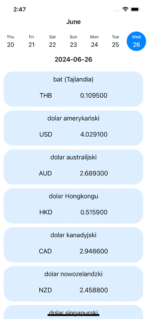

# ExchangeRates

Very simple app with average exchange rates of foreign currencies.

Characteristics:
- any day from the past or today can be selected
- data is obtained from REST API call to NBP endpoints (National Bank of Poland)
- if selected date does not provide data, app asks recursively for data from previous day and displays label with information about effective date of data
- table with all foreign currencies in table A (B and C are also available) are shown to the user
